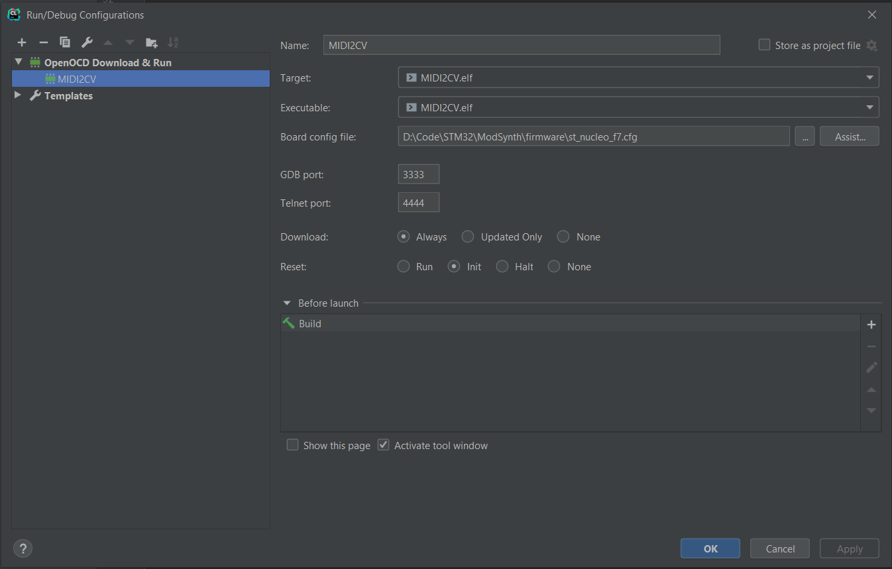
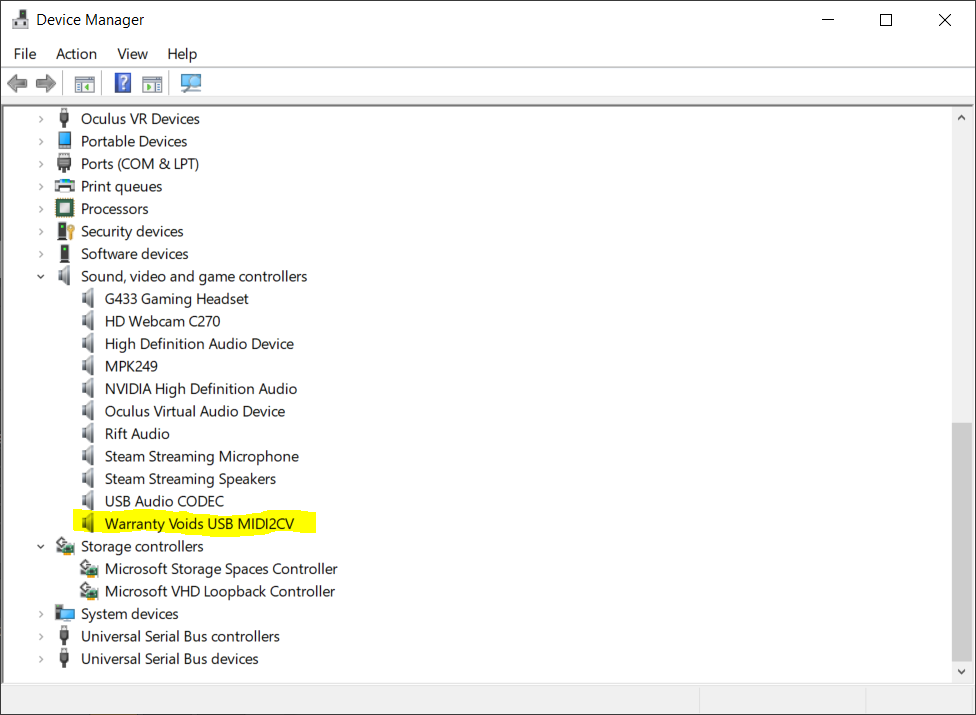
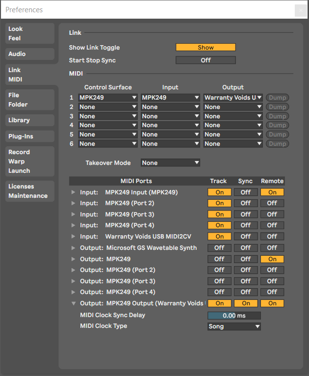
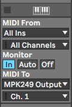

# Firmware
The firmware can be found at the [GitHub Page](https://github.com/warrantyvoids/ModSynth/tree/master/firmware).

The main stubs were generated using STM32CubeMX, and imported in CLion.
We start by selecting the STM32F767ZITx - NUCLEO-F767ZI board. We set all peripheral
options to their default values and enable the following modules:
- DAC (OUT1 and OUT2)
- USB_OTG_FS
- GPIO Ports for GATE and TRIGGER

## Building and Running

[JetBrains has quite an reasonable walkthrough](https://www.jetbrains.com/help/clion/2020.1/embedded-development.html?utm_campaign=CL&utm_content=2020.1&utm_medium=link&utm_source=product#) for creating
such a project. If you do not have a CLion license or are not willing to go through the
additional pain of setting it up, you can just as well use [STM32CubeIDE](https://www.st.com/en/development-tools/stm32cubeide.html).

For Windows 10, I've found that the best combination of tools are:
- WSL for compilers (gcc-arm-none-eabi) and build infra.
- Windows for OpenOCD.

If you have everything set-up, you should be able to compile the project and flash it.
For CLion, don't forget to modify the Run-configuration to OpenOCD!
.

## Verifying it works
First, make sure Windows actually recognizes your USB device! **As the STM32 Nucleo manual states cleary:
Do not power the device from the User USB!**

Connect the ST-LINK side, and then the User USB side.
Make sure you flash the program from your favourite IDE.

_Note: When debugging, if you are in a breakpoint; stop and reflash or reload
your firmware, Windows will often report that something is wrong with your latest USB device.
For some reason I have not been able to track down yet, the USB Device driver responds
with a bunch of 0's, leading to an invalid USB descriptor. The workaround is resetting your device,
unplugging the user USB connection and reconnecting it._

Open the Device Manager; The MIDI 2 CV interface should now be visible!

Open up Ableton Live, or Studio One (or your favourite MIDI editor). Set-up your MIDI
device to send to the new USB device.

As soon as you press a key on your keyboard or MIDI controller, you should see a green light
light up on the STM32 Nucleo!